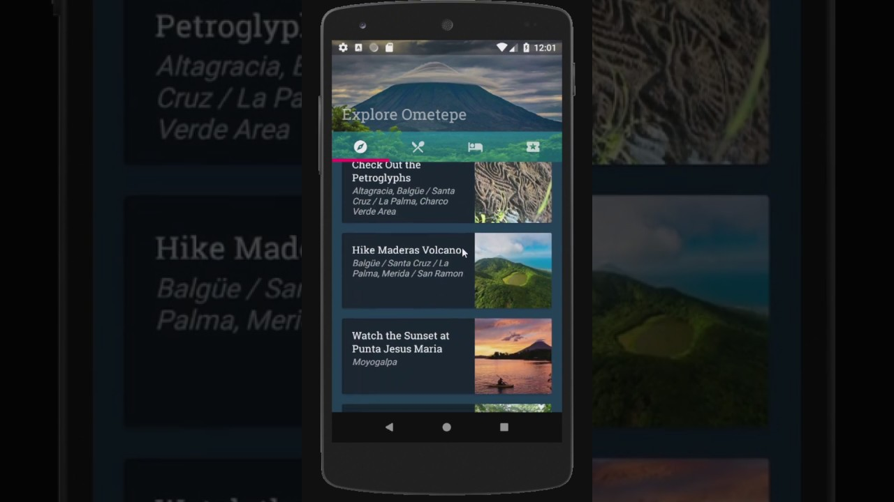
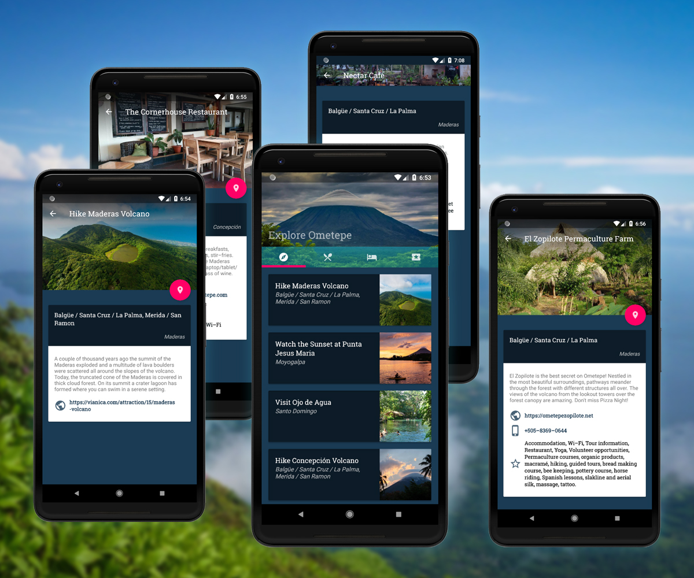

## Grow With Google Android Basics Nanodegree: PROJECT 5
# Explore Ometepe - Tourism App

Used **API 27: Android 8.1 (Oreo)**

## Walkthrough

_[Watch on YouTube](https://www.youtube.com/watch?v=L3YRb_MxeQ8)_

## Screenshots

## Additional Features
1. ListView replaced with RecyclerView
2. Contractable layout based on CheeseSquare
3. CardViews based on Material Design
4. Lift on Touch animation onClick for CardViews
5. Transparent toolbar

## Resources
 - [Lift on Touch animation for CardViews](https://stackoverflow.com/questions/44393762/cardview-lift-on-touch)
 - [Using of ConstraintLayout to build out CardView with Material Design](http://eugenebrusov.com/cardview-with-constraintlayout/
)
 - [CheeseSquare by Chris Banes gives a really good head start for implementing various android design lib features.](https://github.com/chrisbanes/cheesesquare)
 - [Demo Recycler by The Bailey Brew](https://github.com/thebaileyBrew/Angry_Nerds_Demo_Recycler)
 - Fonts by Google Fonts
 - App Icon - purchased royalty-free icon
 - Photos with permission by me, the venue owners and friends while living and traveling on Ometepe Island, Lake Nicaragua
